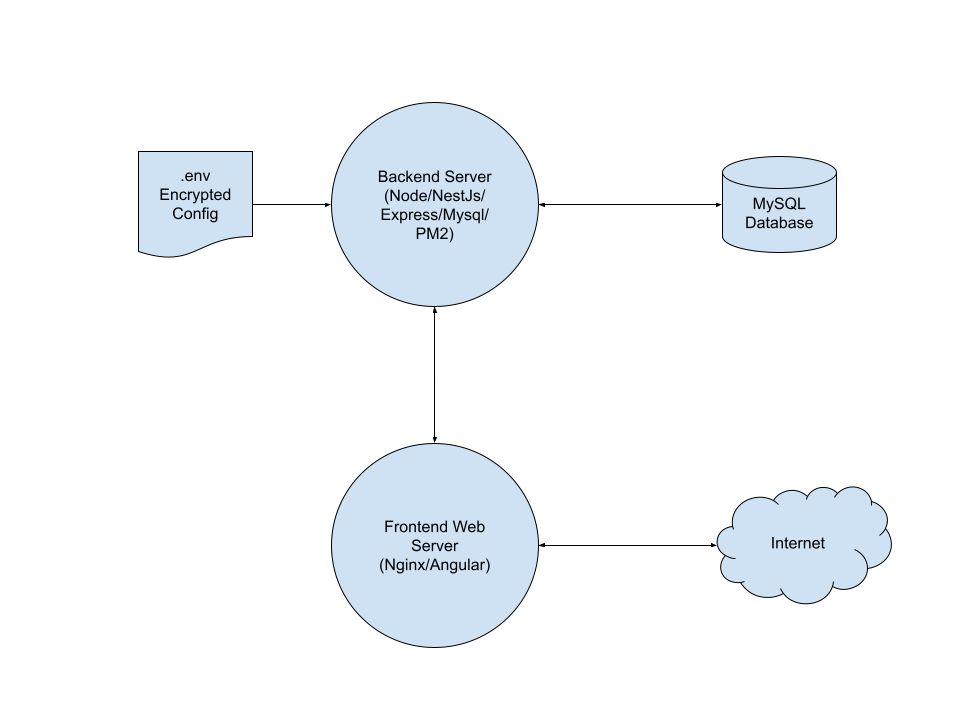

# sacredtextsearch
## What it is
Search and characterization of book/chapter/verse from sacred texts 
of various religions.

This app was originally written in PHP, but was migrated to Angular/Typescript
on the frontend and NestJs/Typescript on the backend. The original PHP source
was inadvertently lost when migrating from BitBucket to GitHub. 

## Database
The backend database schema attempts to generically organize
segments of scriptural and other ancient works. The sources of the data are
varied: some were scavenged from the Gutenberg project and other sites, while 
others were taken from other databases. Every attempt was made to ensure that
only public domain data was used. If any non-public data exists in the database,
it is completely unintentional.

```
Religion --+
           |
         Tome --+
                  |
                Book --+
                        |
                      Verse
```

The `backend/database/loads` directory contains some of the code
used to load the database. It looks as though some of the data
loading may have been lost. It also looks as though some items were
not yet loaded, including the **Norse**, **Hindu**, 
and **Analects of Confucius** texts. There are PHP
scripts there that may or may not work. There is also a set
of Bible inconsistencies that was apparently in progress.

## Architecture

The sacredtextsearch application has a frontend user interface supported by a 
backend to retrieve and return information stored in a MySQL database.


The frontend and backend servers may run on the same or different machines, 
and the MySQL database can likewise be hosted on the same machine, on a separate server, 
or as a data service like Amazon&#39;s RDS. RDS is recommended for production use due for its
security and backup options.

The common programming language for both ends is 
<a href="https://www.typescriptlang.org/">Typescript</a>, a typed abstraction
of <a href="https://developer.mozilla.org/en-US/docs/Web/JavaScript">JavaScript</a>.

## Shared Sources
The `backend/src/shared` directory contains code shared by both ends of the app.
Node requires all sources to be within the same src tree, while Angular does not.
Otherwise, it would have been placed at a level between them.

### Note
Initially, the database entities structures in Typescript were used
on both ends, to reduce code duplication. That is not recommended as a
good practice, but I favored it anyway. It turned out that the recommendation
was at least practical, since the Angular frontend reached a point where
it would no longer compile based on TypeOrm issues. The upshot is that I had
to duplicate the entities in the backend/src/shared/entity-interfaces files.
I continue to dislike the need for that practice, but I had to give up on it.


